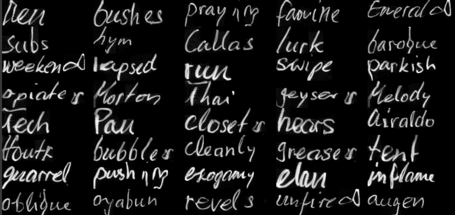

# GANwriting

An implementation of [this paper](https://arxiv.org/abs/2003.02567), originally done for the Weights & Biases paper reproducibility challenge (we didn't have the time or compute to complete it within the deadline). So we decided to make a web app out of it, which is in the works. 

Trained for 5000 epochs on the IAM500 dataset resulted in the following images:

Each row in the image consists of 5 different words in the handwriting of a different author. 

## Limitations

- Sadly due to the fact that the IAM500 dataset consists of only English words with no special characters or numbers at all, the authors created a tokenization system that only uses those characters. The same model with a different tokenization system and a different dataset might be able to have a wider range of useable characters. 

- They also decided to use a small MLP model for the text encoder due to the above reason. This also means that each word can only be of max length 10, any word shorter than that has to be padded and longer ones have to be split.

- For the word recognizer model the authors used an LSTM based seq2seq model which might not be powerful enough for a larger character set and longer words.

We might able to covercome the first limitation by using byte pair encoding allowing us to encode utf-8 characters.

For the second and third, replacing the text encoder in the generator and the word recognizer with transformer based models might give better results for a bit higher compute costs.

## References
[GANwriting: Content-Conditioned Generation of Styled Handwritten Word Images](https://github.com/omni-us/research-GANwriting) by Lei Kang, Pau Riba, Yaxing Wang, Marçal Rusiñol, Alicia Fornés, and Mauricio Villegas.